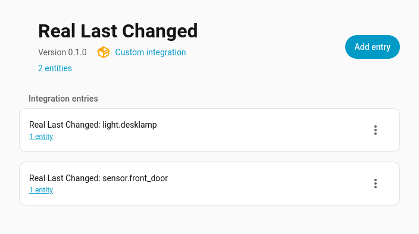

# Real last changed

This component creates entities that track the last time an entity's state has actually been changed. This is meant to make `last_changed` useful even after a HA restart. 

There have been multiple feature requests over the years to make the last changed state persist reboots. 
[2019](https://community.home-assistant.io/t/retain-last-state-change-data-of-a-sensor-after-reboot/125148) [2020](https://community.home-assistant.io/t/what-the-heck-is-with-the-latest-state-change-not-being-kept-after-restart/219480) [2022](https://community.home-assistant.io/t/persistent-version-of-last-changed-for-the-ui/467163) [2024](https://community.home-assistant.io/t/wth-there-is-no-new-last-attribute-that-retains-restart/802413)

## Installation
### HACS
**Real Last Changed** is available via [HACS](https://hacs.xyz/).

Use this link to open the repository directly in HACS:

**Or:**
1. Install HACS if you haven’t already.
2. Open HACS in Home Assistant.
3. Search for **“Real Last Changed”**.
4. Click **Download**.

### Manually
1. Download this repository;
2. Copy the directory **custom_components/ha_real-last-changed** on your Home Assistant **config/custom_components/ha_real-last-changed**;
3. Restart HomeAssistant;
4. Add this integration from the **Home Assistant** integrations.

### Like the Integration?
- Liberapay : 
- BTC: `1CoFc1bY5AHLP6Noe1zmqnJnp7ZWBxyo79`
- ETH: `0xf68f568e21a15934e0e9a6949288c3ca009140ba`
- Monero (XMR): `88wjCuhHX3oNhVpEdYeUx3LvrkdTvcTHx7v7L5fQpjCg7QiAReJUVR4LPase5Byj2UhdVdLtvysJaXTFKq2EnuvuLjvQMGL`
